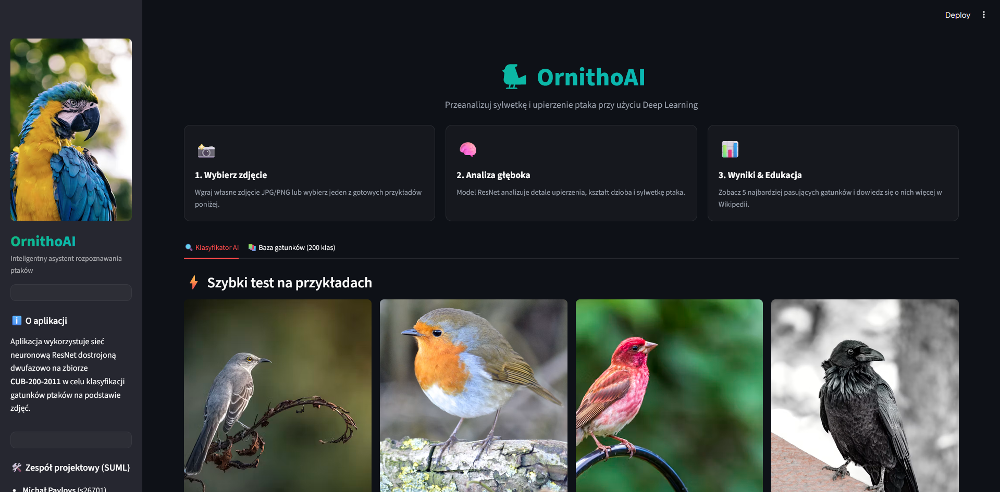
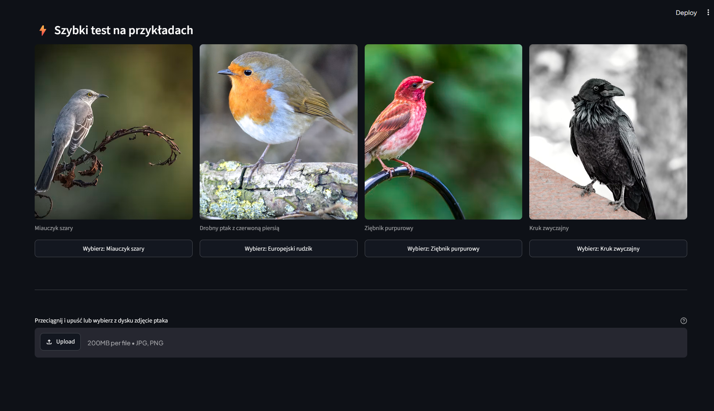
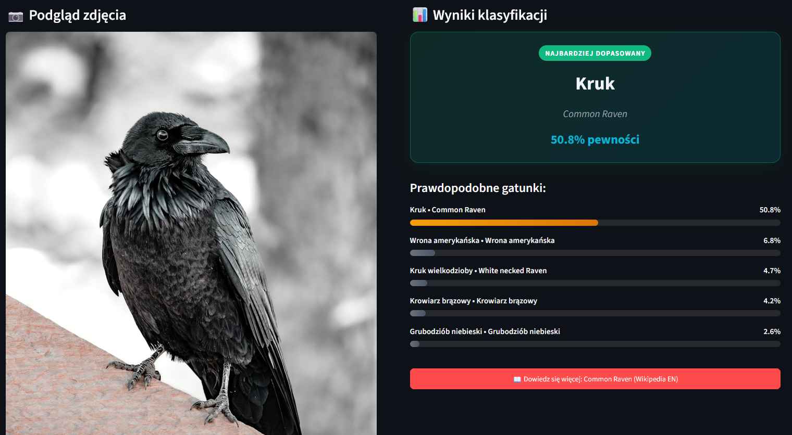
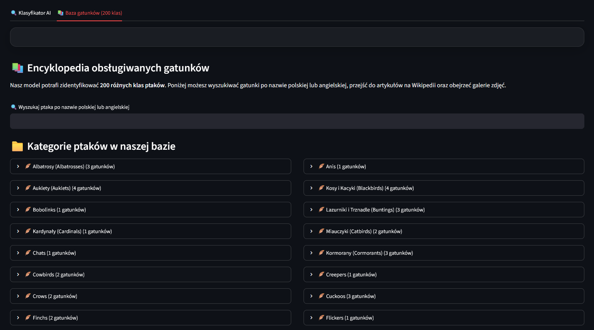

# OrnithoAI - Klasyfikator Gatunków Ptaków

OrnithoAI to modułowa, konteneryzowana aplikacja uczenia maszynowego przeznaczona do klasyfikacji gatunków ptaków. Cały stos technologiczny wykorzystuje **FastAPI** do obsługi wysokowydajnych interfejsów REST API, **Streamlit** do prezentacji czystego i przyjaznego dla użytkownika interfejsu (frontend), **PyTorch** oraz **timm** do serwowania modeli AI, a także **Docker Compose** do pełnej orkiestracji usług.

---

## 🌟 Kluczowe Funkcjonalności

1. **Pretrenowany Model Bazowy ImageNet**: Usługa treningowa (`trainer`) pobiera pretrenowaną architekturę bazową (domyślnie `resnet50`) za pomocą `torchvision.models`, dostraja ją dwufazowo na zbiorze danych **CUB-200-2011** (obejmującym 200 gatunków ptaków) i zapisuje wagi modelu w celu umożliwienia natychmiastowego wnioskowania.
2. **Dynamiczny, Nieblokujący Start Backends**: Podczas uruchamiania backend w bezpieczny sposób odpytuje o współdzielone pliki modelu z wykorzystaniem standardowego modułu `logging`. Jeśli wagi nie zostaną odnalezione w ciągu **5 minut (300 s)**, sekwencja startowa przerywa działanie, zapobiegając zakleszczeniom (deadlockom).
3. **Nieblokująca Pętla Wnioskowania**: Zadania przetwarzania obrazu i propagacji w przód w PyTorch są delegowane do osobnych wątków roboczych za pomocą `asyncio.to_thread`. Zapobiega to blokowaniu głównej pętli zdarzeń FastAPI, która może bez przeszkód przetwarzać kolejne żądania współbieżne.
4. **Automatyczne Przełączanie na CUDA**: Usługa wnioskowania automatycznie wykrywa obecność procesorów graficznych kompatybilnych z CUDA (`cuda`). Obliczenia są automatycznie kierowane na kartę GPU, a w przypadku jej braku system przezroczyście przełącza się na pracę na procesorze (CPU).
5. **Niezależna Architektura**: Konfiguracje modelu, katalogi, pliki wag oraz adresy URL usług API są w pełni sparametryzowane poprzez standardowy plik zmiennych środowiskowych `.env`. Pozwala to na łatwą zmianę architektury modelu (np. z `resnet50` na `efficientnet_b0`) bez modyfikowania kodu rutingu API czy interfejsu.
6. **Docker Healthchecks**: W pliku `docker-compose.yml` zaimplementowano standardowe mechanizmy sprawdzania stanu kontenerów, dzięki czemu aplikacja Streamlit (frontend) uruchamia się dopiero wtedy, gdy FastAPI backend zgłosi status `healthy`.

---

## 📂 Struktura Katalogów Projektu

```
├── backend/
│   ├── app/
│   │   ├── __init__.py
│   │   ├── main.py            # Punkt wejścia FastAPI (oczekuje na plik modelu z 5-minutowym timeoutem)
│   │   ├── config.py          # Ładowanie ustawień przy użyciu Pydantic Settings
│   │   ├── schemas.py         # Schematy Pydantic dla struktur wejściowych/wyjściowych API
│   │   ├── routes/
│   │   │   ├── __init__.py
│   │   │   ├── health.py      # GET /health
│   │   │   └── predict.py     # POST /predict (wykorzystuje asyncio.to_thread do nieblokujących predykcji)
│   │   └── services/
│   │       ├── __init__.py
│   │       └── inference.py   # Usługa wnioskowania z wykrywaniem CUDA/CPU i bezpieczeństwem wątkowym
│   ├── data/                          # [WARSTWA DANYCH] Przygotowanie i transformacje
│       ├── __init__.py
│       ├── dataset.py                 # BirdDataset, augmentacje TRAIN/VAL, random_split
│       ├── bird_names_pl.json         # Mapowanie angielskich nazw klas → polskich (200 klas)
│       └── raw/                       # Miejsce na surowe obrazy CUB-200-2011
│   ├── train/
│   │   ├── __init__.py
│   │   └── train.py           # Dwufazowy fine-tuning: zamrożony szkielet -> pełna sieć (ResNet + AdamW + AMP)
│   ├── .dockerignore          # Wykluczenia pamięci pokrycia, środowisk wirtualnych i wag
│   ├── Dockerfile             # Dockerfile dla środowiska Python 3.13 (FastAPI na porcie 8000)
│   └── requirements.txt       # fastapi, uvicorn, torch, torchvision, timm, pillow
├── frontend/
│   ├── app.py                 # Interfejs Streamlit z podglądem obrazu i wykresami top-5
│   ├── .dockerignore          # Wykluczenia pamięci podręcznej
│   ├── Dockerfile             # Dockerfile dla środowiska Python 3.13 (Streamlit na porcie 8501)
│   └── requirements.txt       # streamlit, requests, pillow
├── docker-compose.yml         # Definiuje usługi backendu, frontendu, trenera, healthchecki i wolumeny
├── pyproject.toml             # Konfiguracja narzędzia Ruff (linter i formatter) oraz Pylint
├── run.sh                     # Lokalny skrypt uruchomieniowy dla systemów Linux/macOS
├── .env.example               # Szablon zmiennych środowiskowych – należy skopiować jako .env przed uruchomieniem
└── README.md                  # Ten plik
```

---

## 📦 Zbiór Danych

Projekt opiera się na zbiorze danych **CUB-200-2011** (Caltech-UCSD Birds) zawierającym 11 788 obrazów reprezentujących 200 gatunków ptaków.

1. Pobierz dane z [oficjalnego źródła](https://www.vision.caltech.edu/datasets/cub_200_2011/) lub za pomocą polecenia:
   ```bash
   wget https://data.caltech.edu/records/65de6-vp158/files/CUB_200_2011.tgz
   tar -xzf CUB_200_2011.tgz -C data/raw/
   ```
2. Oczekiwana struktura folderów to `data/raw/CUB_200_2011/images/<folder_klasy>/*.jpg`.

> **Uwaga:** Zbiór danych ani wagi wytrenowanego modelu nie są przechowywane w repozytorium ze względu na ich duży rozmiar. Przed uruchomieniem backendu należy uruchomić moduł treningowy w celu wygenerowania pliku `models/bird_classifier.pt`.

---

## 🚀 Uruchomienie Aplikacji

### 🐳 Opcja A — Docker (rekomendowana)

Upewnij się, że na Twoim komputerze są zainstalowane narzędzia [Docker](https://www.docker.com/) oraz [Docker Compose](https://docs.docker.com/compose/).

Skopiuj szablon zmiennych środowiskowych:
```bash
cp .env.example .env
```

Zbuduj i uruchom wszystkie kontenery jednym poleceniem:
```bash
docker compose up --build -d
```

Powoduje to uruchomienie następującej sekwencji zdarzeń:
1. **Generowanie Modelu**: Usługa `trainer` wykonuje skrypt `backend/train/train.py`, pobiera sieć bazową `resnet50`, przeprowadza uczenie, zapisuje wagi w udostępnionym katalogu `./models` i kończy pracę (chyba że zmienna `SKIP_TRAIN` jest ustawiona na `true`).
2. **Uruchomienie API**: Kontener `backend` oczekuje na pojawienie się pliku wag z procesu uczenia, ładuje go na dostępny sprzęt (CUDA lub CPU) i zgłasza status gotowości (healthy).
3. **Uruchomienie Frontendu**: Kontener `frontend` z aplikacją Streamlit startuje w momencie, gdy backend zgłosi pomyślne uruchomienie i stan zdrowy.

**Zatrzymanie usług z zachowaniem wag modelu:**
```bash
docker compose down
```

**Całkowite usunięcie plików wag modelu:**
Usuń katalog `./models/` z poziomu komputera hosta:
```bash
rm -rf models/
```

---

### 🐍 Opcja B — Lokalnie (Python 3.13 + venv)

**Wymagania wstępne:** Python 3.13, menedżer pakietów `pip`.

Utwórz i aktywuj wirtualne środowisko, a następnie zainstaluj niezbędne zależności:
```bash
python3.13 -m venv .venv_suml
source .venv_suml/bin/activate          # Systemy Linux/macOS
# .venv_suml\Scripts\Activate.ps1      # System Windows (PowerShell)

pip install -r backend/requirements.txt -r frontend/requirements.txt
```

Skopiuj szablon zmiennych środowiskowych:
```bash
cp .env.example .env
```

**Uruchomienie dla systemów Linux/macOS** — uruchom wszystko jednym skryptem:
```bash
./run.sh
```


Skrypt automatycznie uruchomi proces uczenia, poczeka na gotowość serwera API (backend), a na końcu włączy interfejs Streamlit (frontend).

---

## 🌐 Adresy Usług

| Usługa | Adres URL |
|---------|-----|
| Streamlit Frontend | http://localhost:8501 |
| FastAPI Swagger UI (Dokumentacja API) | http://localhost:8000/docs |
| Sprawdzenie Stanu Backend (Health Check) | http://localhost:8000/health |

---

## 🔍 Weryfikacja i Rozwiązywanie Problemów

**Sprawdzenie statusu kontenerów (Docker):**
```bash
docker compose ps
```
Zarówno `bird-classifier-backend`, jak i `bird-classifier-frontend` powinny mieć status `healthy`.

**Podgląd logów aplikacji (Docker):**
```bash
docker logs bird-classifier-trainer
docker logs -f bird-classifier-backend
```

---

## 📊 Format Danych Wejściowych i Wyjściowych

### Dane Wejściowe (Input)
Aplikacja akceptuje obrazy przedstawiające ptaki.
* **Formaty plików:** `.jpg`, `.jpeg`, `.png`.
* **Przesyłanie przez interfejs (Streamlit):** Poprzez wgranie pliku w oknie przeglądarki (drag and drop) lub kliknięcie jednego z gotowych przykładów zdjęć zintegrowanych w aplikacji.
* **Przesyłanie przez API (`POST /predict`):** Plik musi zostać przekazany jako żądanie typu `multipart/form-data` pod kluczem o nazwie `image`. Przesyłany plik musi posiadać typ MIME rozpoczynający się od prefiksu `image/` (np. `image/jpeg`).

### Format Wyniku (Output)
Po przesłaniu pliku następuje przetworzenie obrazu (zmiana rozmiaru do formatu dopasowanego do ResNet, normalizacja wartości pikseli) i przesłanie go do modelu sieci neuronowej.
1. **Odpowiedź z API backendowego:** Serwer zwraca strukturę w formacie JSON z listą najbardziej prawdopodobnych klas (gatunków) wraz z poziomem ufności (wartość od 0.0 do 1.0):
   ```json
   {
     "predictions": [
       {
         "species": "012.Yellow_billed_Cuckoo",
         "confidence": 0.9427
       },
       {
         "species": "011.Rusty_Blackbird",
         "confidence": 0.0215
       },
       ...
     ]
   }
   ```
2. **Prezentacja na interfejsie użytkownika:**
   * **Karta Głównego Dopasowania (Najbardziej dopasowany):** Prezentuje nazwę gatunku o najwyższym współczynniku pewności przetłumaczoną na język polski (przy pomocy pliku mapowania `bird_names_pl.json`) oraz jego oryginalną nazwę angielską (np. "Kacyk rdzawy" dla "Rusty Blackbird") wraz z procentowym wskaźnikiem pewności.
   * **Wykresy Prawdopodobieństwa (Top-5):** Lista 5 najbardziej prawdopodobnych gatunków zobrazowana kolorowymi paskami postępu (Zielony dla pewności >= 70%, Pomarańczowy dla pewności od 35% do 69%, Szary dla pewności poniżej 35%).
   * **Integracja z Wikipedią:** Przycisk "Dowiedz się więcej" automatycznie przekierowuje użytkownika do artykułu na angielskiej Wikipedii dedykowanego wybranemu gatunkowi.
   * **Baza Gatunków (Encyklopedia):** Osobna zakładka interfejsu umożliwia przeglądanie pełnego spisu 200 obsługiwanych klas ptaków podzielonych na rodziny (np. Albatrosy, Mewy, Zimorodki), wyszukiwanie ich po nazwach polskich i angielskich oraz bezpośrednie przechodzenie do ich zdjęć w Google Grafika lub opisów w Wikipedii.

---

## 📸 Jak Używać Aplikacji — Instrukcja Krok po Kroku

Poniżej znajduje się krótka instrukcja wizualna przedstawiająca obsługę interfejsu graficznego aplikacji:

### Krok 1: Uruchomienie i Panel Główny
Po poprawnym uruchomieniu kontenerów lub skryptów lokalnych otwórz przeglądarkę pod adresem [http://localhost:8501](http://localhost:8501). Zobaczysz główny panel aplikacji z informacjami o projekcie po lewej stronie oraz trzema krokami instrukcji na środku.



### Krok 2: Wybór lub Przesłanie Obrazu
Możesz przetestować aplikację klikając przycisk wyboru pod jednym z gotowych zdjęć przykładowych w sekcji **"Szybki test na przykładach"**, bądź przeciągnąć i upuścić własne zdjęcie ptaka (w formacie JPG, JPEG lub PNG) do obszaru wgrywania plików.



### Krok 3: Analiza i Wyniki
Aplikacja natychmiast wyśle zdjęcie do backendu, a po prawej stronie wyświetli wyniki klasyfikacji. Zobaczysz gatunek o najwyższym dopasowaniu (wraz z polską i angielską nazwą) oraz listę alternatywnych gatunków z wykresami słupkowymi. Kliknij przycisk **"Dowiedz się więcej"**, aby przejść do artykułu na Wikipedii.



### Krok 4: Przeglądanie Encyklopedii Gatunków
Przejdź do zakładki **"Baza gatunków (200 klas)"**, aby wyszukiwać ptaki według słów kluczowych lub przeglądać pełne drzewo systematyczne zintegrowane w bazie. Z tego poziomu możesz bezpośrednio szukać zdjęć ptaków w Google Grafika lub czytać o nich w encyklopedii.


